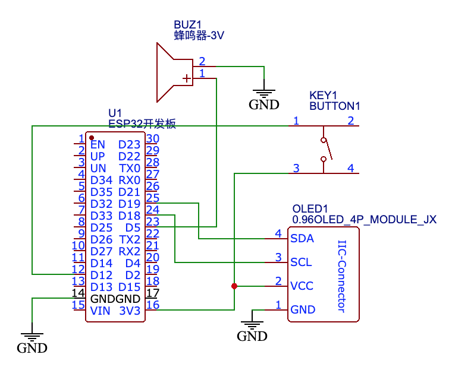
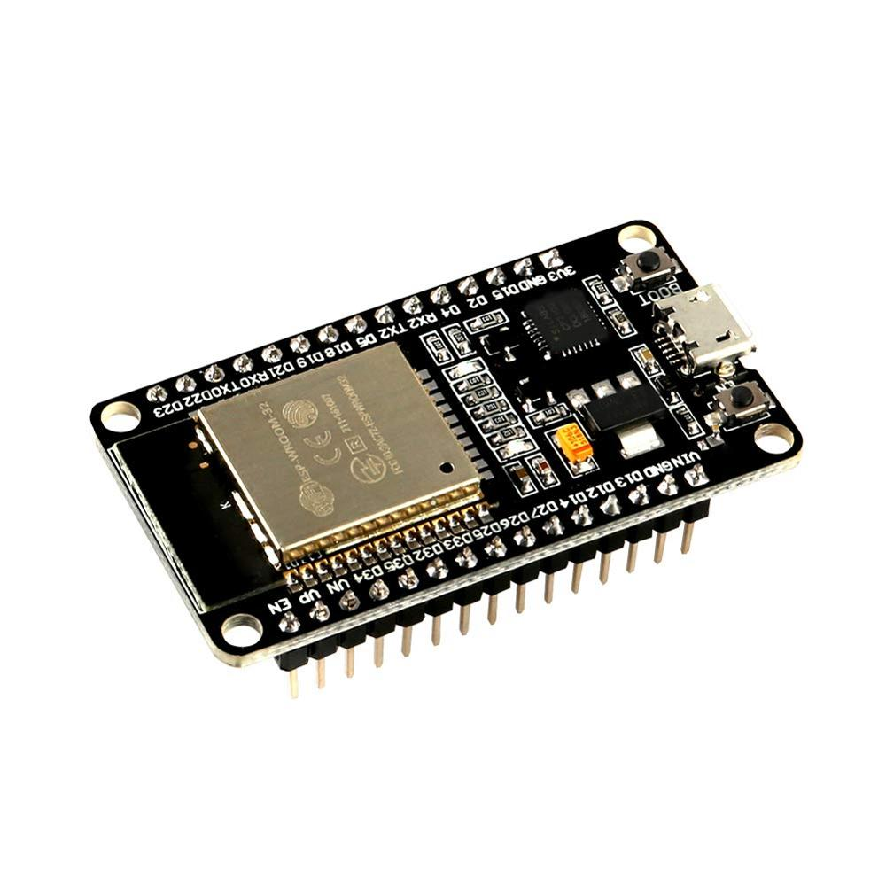
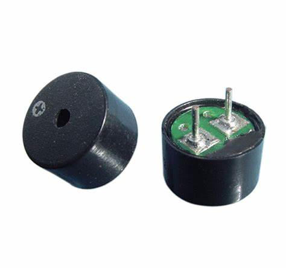
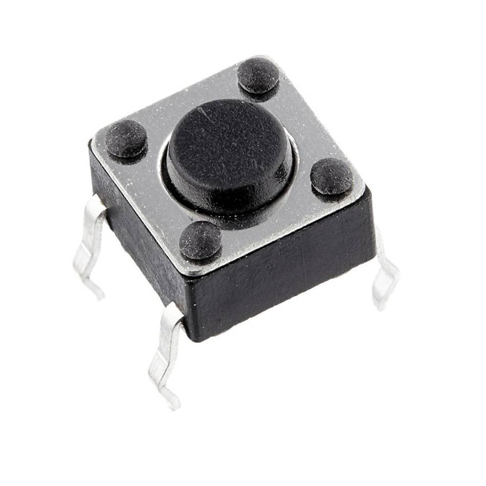
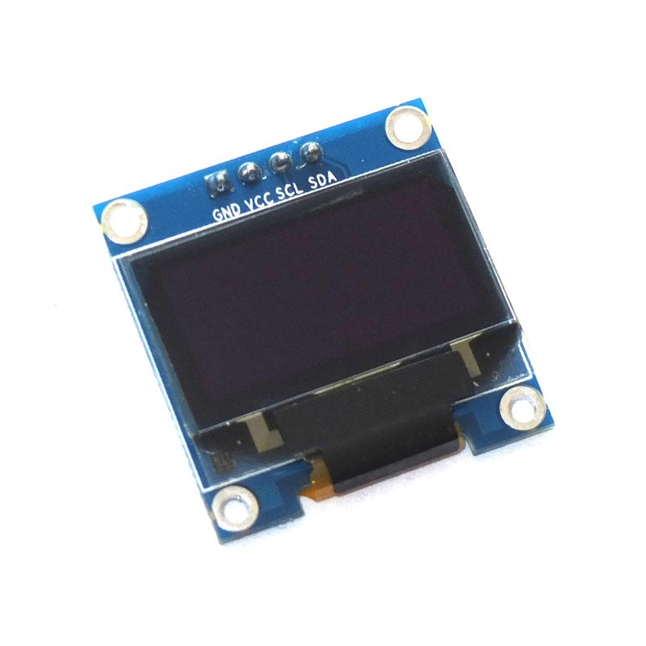

# FlyingBird
 A flying bird game written with MicroPython

# Convert image data to gs2  

* Tool is located here [image2gs2](tools/image2gs2.py) 
* About GS2 [https://docs.micropython.org/en/latest/library/framebuf.html](https://docs.micropython.org/en/latest/library/framebuf.html) 

# The circuit diagram  

  

# Devices list  

| Device | Photo |
| --- | --- |
| ESP32 |  |
| Buzzer |  |
| Button |  |
| I2C OLED 128x64 |  |